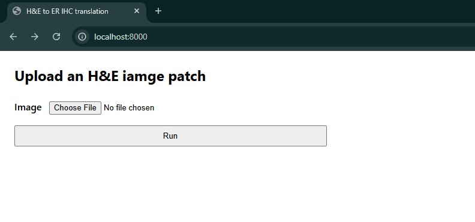
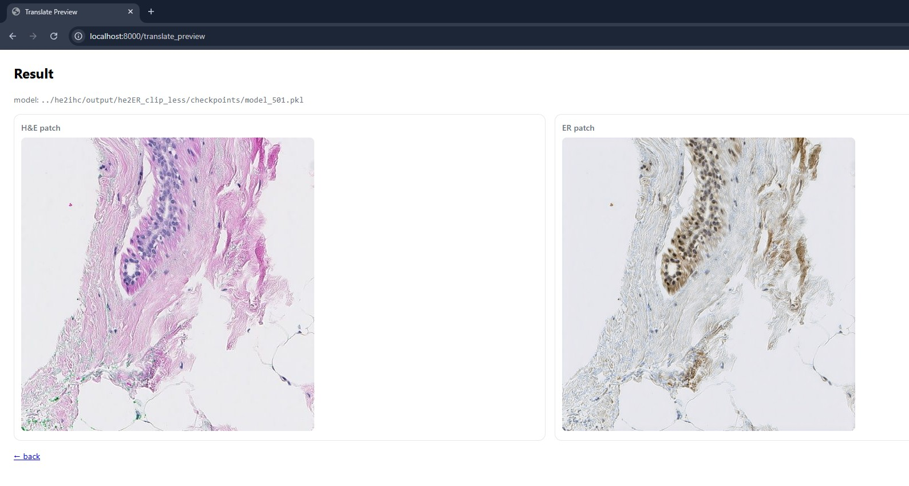

# HE2IHC Stain Transfer

This project provides tools and pipelines for performing **stain transfer** between H&E (Hematoxylin & Eosin) and IHC (Immunohistochemistry) images using diffusion based model. Stable diffusion XL is fine tuned using LoRA adapters.  It includes training scripts, inference pipelines, and fast-api based deployment.

---

## 📂 Project Structure

```
HE2IHC_stain_transfer/
│── app/
│   ├── pipeline.py               # Main processing pipeline
│   ├── server.py                 # Server script for API deployment
│   └── src/
│       ├── image_prep.py         # Image preprocessing utilities
│       ├── model.py              # Model architecture definitions
│       ├── my_utils/             # Helper functions and utilities
│       ├── stain_transfer.py     # Core stain transfer logic
│       └── train_staintransfer.py# Training script
│
│── requirements.txt              # Python dependencies
│── start.sh                      # Script to start the application
```

---

## 🚀 Getting Started

### 1. Clone the repository
```bash
git clone <repo_url>
cd HE2IHC_stain_transfer
```

### 2. Install dependencies
```bash
pip install -r requirements.txt
```

---

## 🌐 Running on Server

To launch the backend server:

```bash
bash start.sh
```

This will start the server defined in `app/server.py`.  
Once running, you can interact with the service via API endpoints.

---

## 📦 Requirements

All required dependencies are listed in [`requirements.txt`](requirements.txt). Install them with:

```bash
pip install -r requirements.txt
```


## 🖥️ Server UI & Example Result

Once the server is running, open:

- **Upload page:** http://localhost:8000  
  Upload an H&E patch and click **Run**.

- **Result page:** http://localhost:8000/translate_preview  
  You will see the input **H&E patch** on the left and the translated **ER IHC patch** on the right.

**Screenshots** (from a working run):

Upload page:



Example result:

